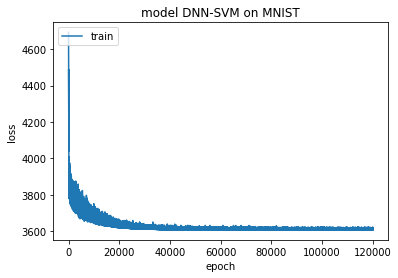
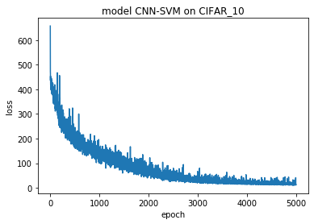

Implametation Neural Network with Support Vector Machines (SVMs) for Classification
===


*This project was inspired by Y. Tang's [Deep Learning using Linear Support Vector Machines](https://arxiv.org/abs/1306.0239)
(2013), and by Abien Fred M. Agarap's [An Architecture Combining Convolutional Neural Network (CNN) and Support Vector Machine (SVM) for Image Classification](https://arxiv.org/pdf/1712.03541)


## Usage

First, clone the project.

Then, go to the repository's directory, and open the following notebooks to check the verification results on 3 different datasets ([MNIST](http://yann.lecun.com/exdb/mnist/), [CIFAR_10](https://www.cs.toronto.edu/~kriz/cifar.html), [fer_13](https://www.kaggle.com/ahmedmoorsy/facial-expression)).

- DNN on MNIST.ipynb
- CNN on CIFAR_10.ipynb
- 
## Implementations
To implement the algorithm that replacing the soft-max layer with a linear support vector machine, we took several steps as following:
#### 1 
We tried two different methods to construct DNN and CNN model. 

One of them is to use keras api to create a keras model. It is a stable and efficient way to implement neural network. However, there is no SVM model for DNN or CNN in keras and it is impossible for us to replace the softmax layer with the SVM layer. Even we try to define the SVM by ourselves to match the requests, we still fail to obtain the loss and the expression of weights and biases. So, we try the second method[1]: Constructing the NN model by defining each layer, loss function, and optimizer process. 

In normal CNN model, the last layer is the softmax function and the output is the probability of each class:

``` $$p_i = \frac{exp(a_i)}{\sum_{j}exp(a_j)}$$```

and the predicted class ```$\hat{i}$```

```$$\hat{i} = \text{arg} \max p_i$$```

We use cross-entropy loss here.

With Support Vector Machines, we delete the softmax layer and output the result from the last layer(Attention: No biases). Then, we define the soft margin loss[2]:

```$$\min_w w^Tw + C\sum_{n=1}^{N}\max(1-w^T x_n y_n,0)^2$$```

Actually, the primal form is L1_SVM with the standard hinge loss. But it is not differetiable so we use L2-SVM instead. 

To predict the class of data:

```$$\hat{i} = \text{arg}_y \max (w^Tx)y$$```

Here we only use linear SVM. 

#### 2
To implement Multiclass SVM, we use one-vs-rest approach. For K class problems, K linear SVMs are trained independently. The output of the $k$-th SVM is

```$$a_k(x) = w^Tx$$```

and the predicted class is

```$$\text{arg}_k \max a_k(x)$$```


#### 3
We also meet the problem that the graph is colorful. In this case, we consider one more parameter in our model, channel. If the data has k color channels,then we need k times parameters at the beginning. Actually, there are no much difference between the black-white data and colorful data. In implement this model for CIFAR-10 dataset.

## Results

#### 1. DNN with SVM v.s. DNN with softmax on [MNIST](http://yann.lecun.com/exdb/mnist/).

The hyperparameters used on MNIST were manually assigned, and not through optimization.

|Hyperparameters|CNN-Softmax|CNN-SVM|
|---------------|-----------|-------|
|Batch size|200|200|
|Learning rate|1e-3|1e-3|
|Steps|120000|120000|
|SVM C|N/A|2|

The experiments were conducted on a laptop computer with Intel Core(TM) i5-6300HQ CPU @ 2.30GHz x 4, 16GB of DDR3 RAM,
and NVIDIA GeForce GTX 960M 4GB DDR5 GPU.

, , , 

**Figure 1. Training accuracy and loss of CNN-Softmax and CNN-SVM on MNIST**

We used a simple fully connected model by first performing PCA from 784 dimensions down to 70 dimensions. The data is then divided up into 300 minibatches of 200 samples each. We trained using stochastic gradient descent with momentum on these 300 minibatches for 400 epochs, totaling 120K weight updates. To prevent overftting and critical to achieving good results, a lot of Gaussian noise is added to the input. Noise of standard deviation of 1.0 is added.

Two hidden layers of 512 units each is followed by a softmax or a L2-SVM. The accuracy of DNN-softmax on the testset is 0.9789. The accuracy of DNN-SVM on the testset is 0.9757. There are no problems about overfitting.

#### 2. CNN with SVM v.s. CNN with softmax on [CIFAR_10](https://www.cs.toronto.edu/~kriz/cifar.html).

##### parameters of CIFAR_10 dataset
|features|parameters|
|---------------|-----------|
|data dimension|32*32|
|optimizer|RMSprop|
|training_steps| 5000|
|pooling layer| 2*2 to 1*1|
|dropout rate| 0.2|
|chanel|3|
|first layer|32|
|second layer|64|
|last layer|3072|
|local receptive fields|5*5|

, ,,

**Figure 2. Training accuracy and loss of CNN-Softmax and CNN-SVM on CIFAR_10**

For normal CNN-softmax, the accuracy of test set is 0.691.
For CNN-SVM, the accuracy of test set is 0.725.
We may claim that in this case, the second model has a better performance.

#### 3. CNN with SVM v.s. CNN with softmax on [fer-13](https://www.kaggle.com/ahmedmoorsy/facial-expression).

##### parameters of fer-13 dataset
|features|parameters|
|---------------|-----------|
|data dimension|35887*3|
|pixels dimension|48*48|
|optimizer|RMSprop|
|train_step|3000|
|pooling layer|2*2 to 1*1|
|dropout_rate|0.4|
|chanel|3|

, , , 

**Figure 3. Training accuracy and loss of CNN-Softmax and CNN-SVM on fer-13.**

For normal CNN-softmax, the accuracy of test set is 0.542. For CNN-SVM, the accuracy of test set is 0.549.
We may claim that in this case, the second model has a slightly better performance.

## References

[1]. https://github.com/aymericdamien/TensorFlow-Examples/tree/master/tensorflow_v2

[2]. https://github.com/AFAgarap/cnn-svm/tree/35-implement-cnn-svm-tf2/model

